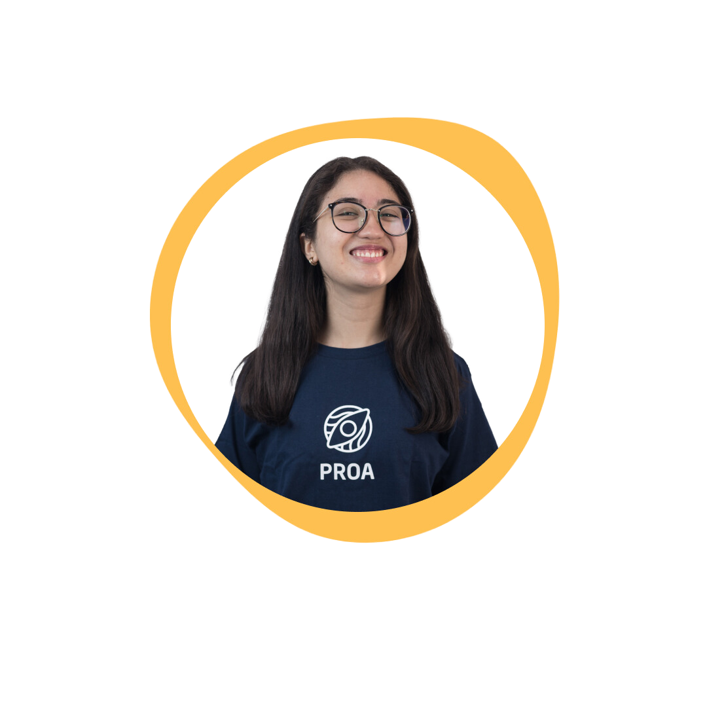
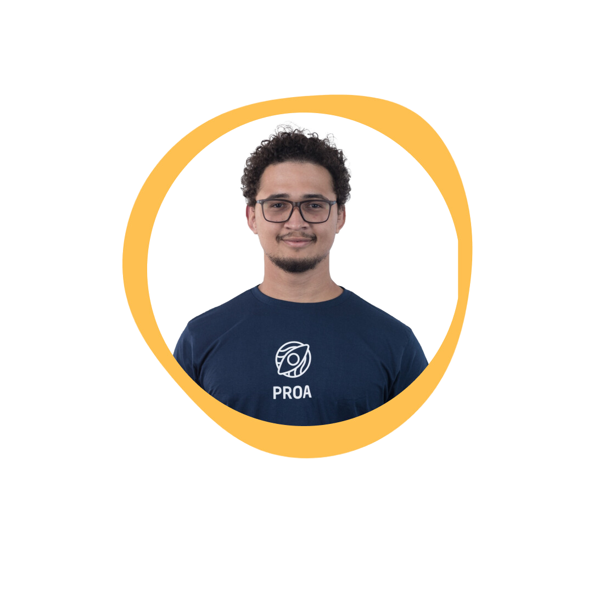
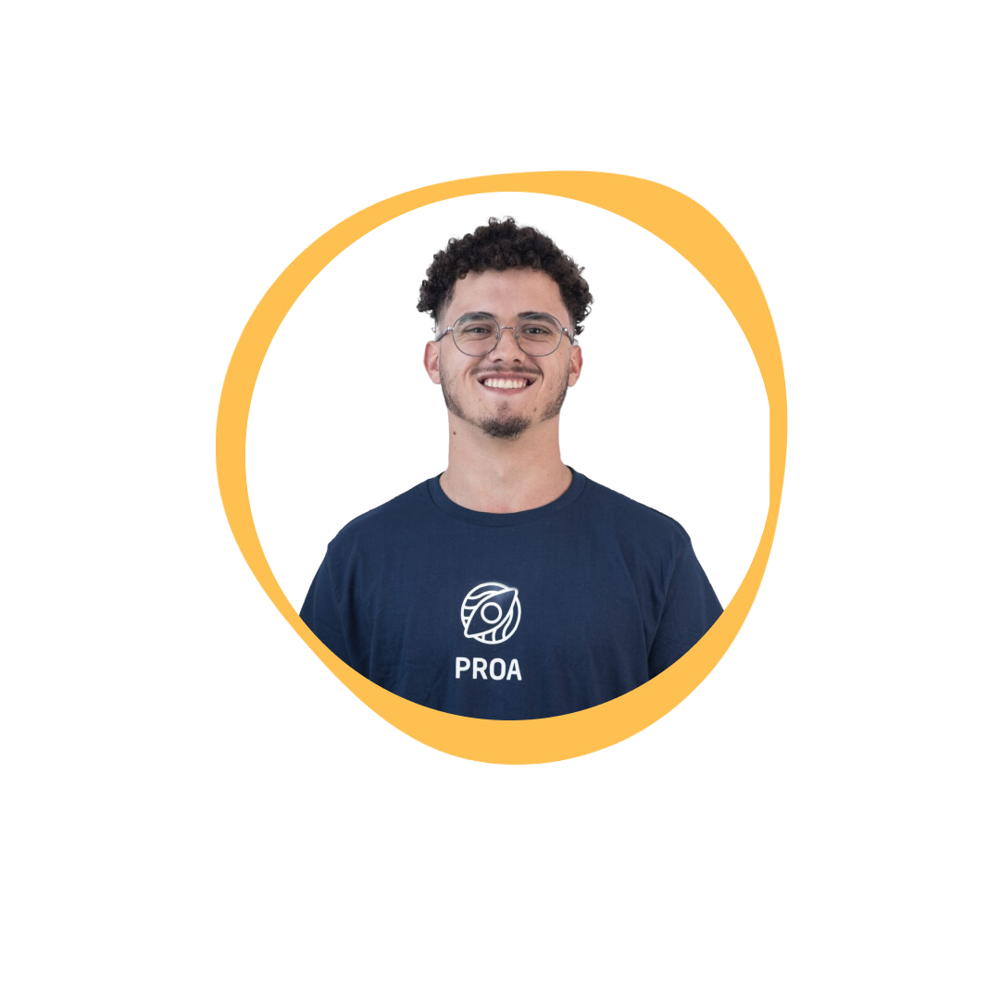
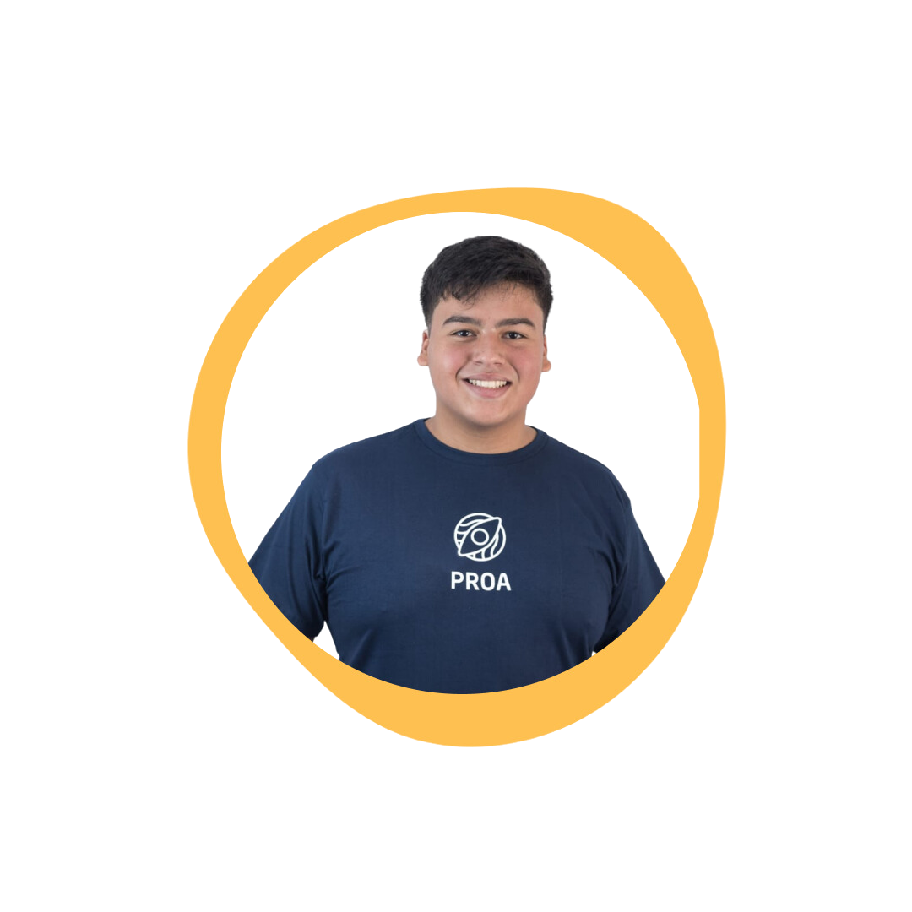
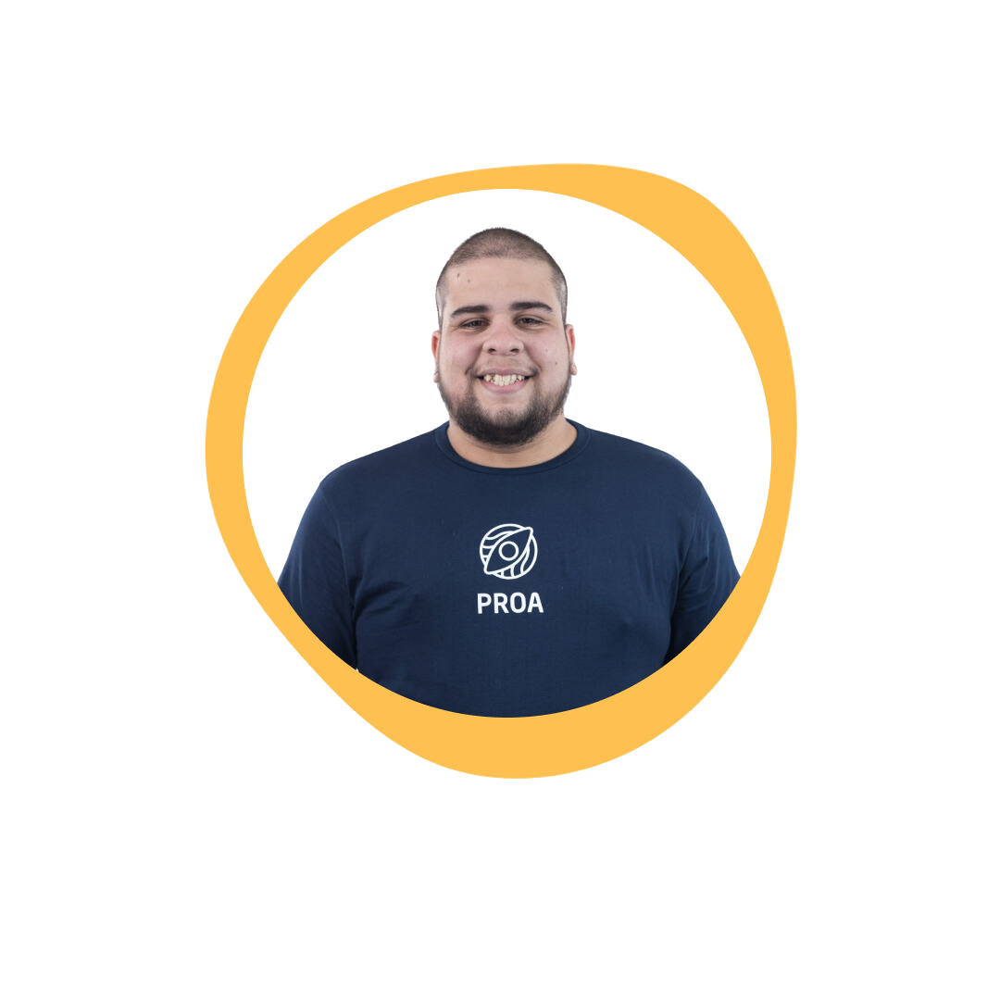
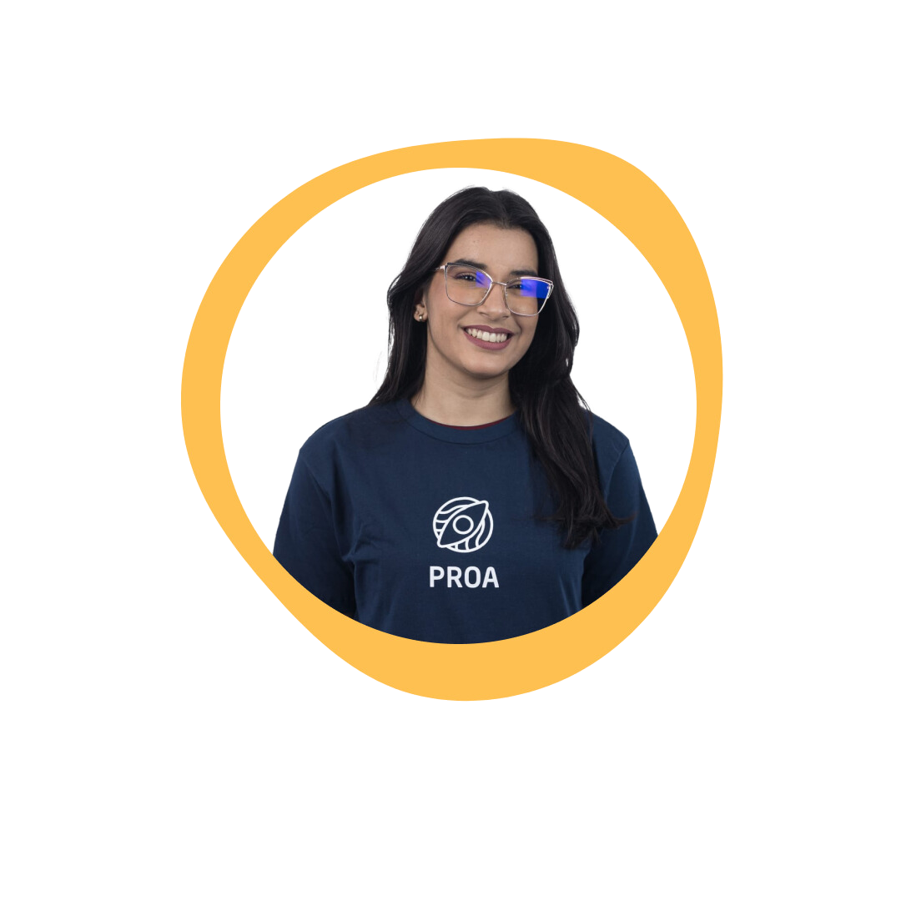
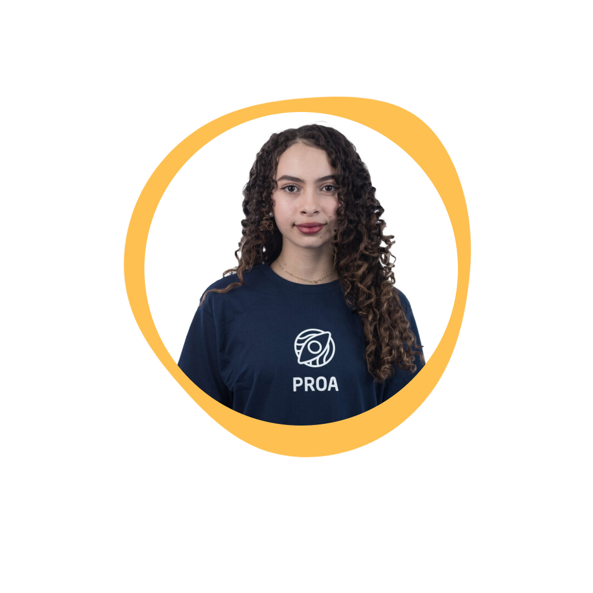
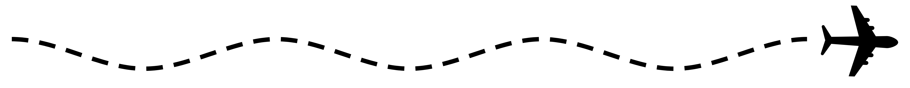

# VOOAZ: O mundo é para Todos

## Objetivo do projeto 

VOOAZ é um aplicativo mobile que visa facilitar viagens para pessoas com deficiência auditiva ou visual. Através de guias personalizados e uma comunidade inclusiva, buscamos tornar a experiência de viajar mais acessível e prazerosa.

### Tecnologias usadas

## Funcionalidades 

* **Guias personalizados:** Criação de guias turísticos adaptados às necessidades de cada usuário.
* **Comunidade:** Espaço para interação entre usuários, troca de experiências e dicas de viagem.
* **Acessibilidade:** Interface intuitiva e recursos de acessibilidade para garantir uma experiência fluida.

## Missão
Nós temos como missão, tornar as viagens mais inclusivas e acessíveis, para pessoas com deficiência visual ou auditiva. Atrvés dos nossos recusos, queremos que o nosso público viva novas experiências e sinta-se independente.

## Visão
Ser a principal plataforma de turismo cultural e intercâmbio para pessoas comdeficiência visual e auditiva, reconhecida por oferecer experiências enriquecedoras, acessíveis e inovadoras, que promovem a inclusão e a diversidade no setor de viagens.

## Valores
**Inclusão**: Assegurar acesso igualitário a experiências culturais e turísticas para pessoas cegas e surdas.
**Autonomia**: Promover a independência dos usuários com recursos que garantem viagens seguras e enriquecedoras.
**Acessibilidade**: Criar uma plataforma intuitiva e adaptada às necessidades de viajantes com deficiência.
**Conexão**: Estabelecer uma rede de apoio entre viajantes e guias especializados para experiências personalizadas.
**Respeito à Diversidade**: Valorizar e celebrar as diferenças, promovendo respeito e inclusão em todas as interações do app.

## Próximos passos 

### Curto prazo

- [ ] Criar uma página web do Vooaz para ter um maior alcance.

### Médio prazo
- [ ] Fechar parcerias com empresas e fundações que compartilham a visão de acessibilidade do Vooaz.

### Longo Prazo

- [ ] Expandir a acessibilidade a outros públicos, começando com a inclusão de pessoas em cadeira de rodas.

# Equipe 

Conheça os reponsáveis pelo projeto:

	
	
	
	
	
 	
        
        
	

 

  

## Links Úteis 

* [Figma]  (https://www.figma.com/design/pfqkjOupa5jYwPoLVXwLpS/VOOAZ-DEMODAY)
* [Dossiê] (https://heyzine.com/flip-book/9dae345013.html)
* [Trello] (https://trello.com/b/PBJrBp4h/equipe-3-vooaz-demoday)

## Nossas redes e contatos 

* [LinkedIn](https://www.linkedin.com/company/vooaz})
* [Instagram](https://www.instagram.com/vooaz_)
* [E-mail](mailto:vooaz.mpt@gmail.com)

## Licença 

Este projeto está licenciado sob a licença MIT.

## Agradecimentos 

[Instituto Proa](https://www.instagram.com/instituto.proa/)
[Senac](https://www.instagram.com/senactito/)
